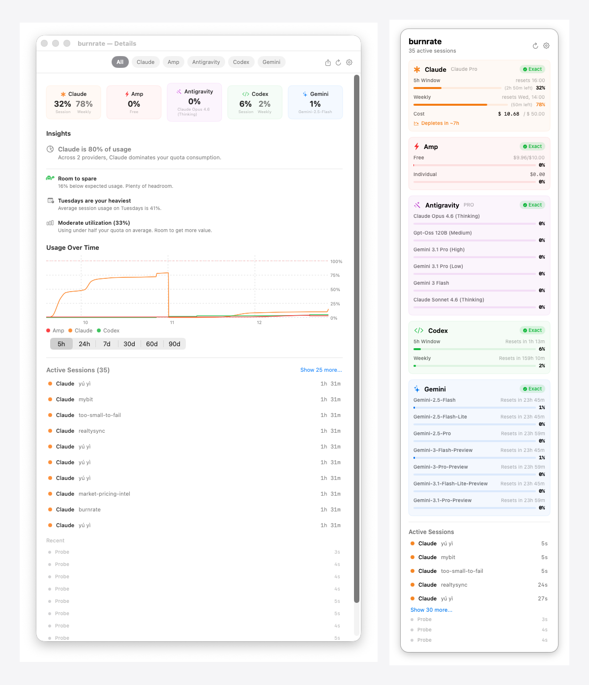

# burnrate

[](https://swift.org)
[](https://developer.apple.com)

**burnrate** is a macOS menu bar app that monitors AI coding assistant usage quotas across 14 providers — so you always know where your budget is going before it runs out.



## Providers

Claude · Codex · Gemini · GitHub Copilot · Cursor · AWS Bedrock · Amp · Kimi · Kiro · Z.ai · MiniMax · Alibaba · Mistral · Antigravity

## Features

- **Menu bar always-on** — quota status visible at a glance, no dashboards to open
- **Burn rate warnings** — pace-aware alerts based on whether you're on track to exhaust quota before the period resets, not arbitrary percentage thresholds
- **14 providers** — enable only the ones you use
- **iOS companion** — quota snapshots synced to iPhone via CloudKit
- **Widgets** — macOS and iOS widgets for at-a-glance status
- **MCP server** — expose quota data to Claude and other MCP-compatible tools
- **Themes** — Dark and Light

## Installation

### Mac App Store
Coming soon.

### Download

Grab the signed DMG or ZIP from [GitHub Releases](https://github.com/theanhgen/burnrate/releases/latest).

### Build from Source

```bash
git clone https://github.com/theanhgen/burnrate.git
cd burnrate
brew install tuist
tuist install
tuist generate
open burnrate.xcworkspace
```

The project uses [Tuist](https://tuist.io) for Xcode project generation. `*.xcodeproj` and `*.xcworkspace` are git-ignored — always run `tuist generate` after cloning.

## Architecture

Three-layer structure with `QuotaMonitor` as the single source of truth:

| Layer | Location | Purpose |
|-------|----------|---------|
| Domain | `Sources/Domain/` | Business logic, models, protocols |
| Infrastructure | `Sources/Infrastructure/` | Probes, storage, network |
| App | `Sources/App/` | SwiftUI views (no ViewModel) |

Shared layers: `CloudSync` (CloudKit for iOS), `WidgetData` (macOS + iOS widgets).

Full docs: [docs/architecture/ARCHITECTURE.md](docs/architecture/ARCHITECTURE.md)

## Contributing

Pull requests welcome. To add a new provider follow the TDD pattern used in the existing probes — see `AntigravityUsageProbe` as the simplest reference.

## License

MIT
